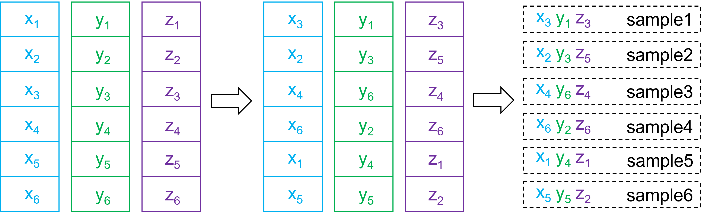

Latin Hypercube Sampling
========================

Latin hypercube sampling is one type of space-filling sampling method. It is often
used to draw input points for emulator training. The following figure gives a
three-dimensional example.

Three random variables :math:`X`, :math:`Y`, and :math:`Z` consist of
a three-dimensional space. If we want to draw :math:`6` samples from this space
using Latin hypercube sampling, we first divide the range of each variable into
:math:`6` equally probable intervals as shown on the left. In each interval,
we pick a value for the corresponding variable. Then we shuffle the picked values
of each variable (e.g. :math:`x_1` to :math:`x_6`) as shown in the middle. Last,
each combination gives us one sample of the three variables as shown on the right.
It should be noted that each sample excludes any other samples from the intervals
that it locates in. This can be straightforwardly extended to draw :math:`M` samples
from :math:`N`-dimensional space consisting of :math:`N` random variables.
  

LHS Class
---------

The :class:`.LHS` class is imported by::
    
    from psimpy.sampler.latin import LHS

Methods
^^^^^^^
.. autoclass:: psimpy.sampler.latin.LHS
    :members: sample

.. warning:: The :class:`.LHS` class considers each random variable being uniformly
    distributed in its range. If this is not the case, one needs to transform picked
    samples accordingly. 