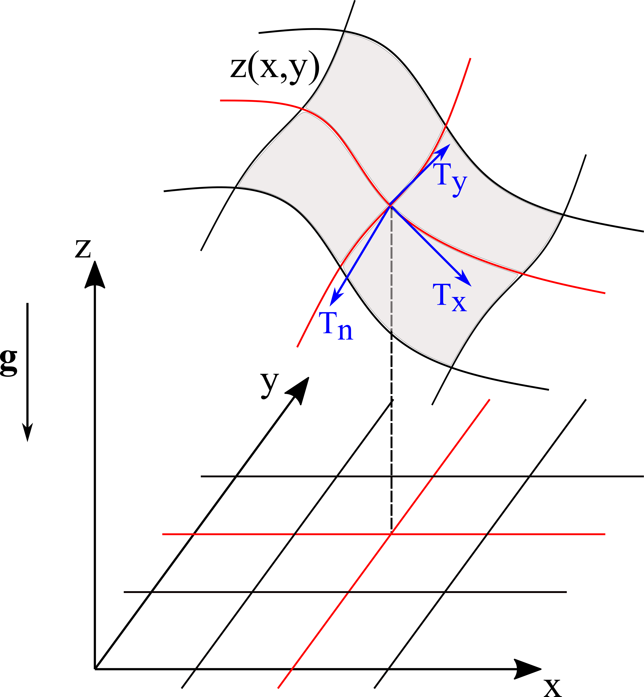

Mass Point Model
================

Theory of mass point model
--------------------------

A `mass point model` is an extremely simplified model to simulate mass movement
on a given topography. It assumes that the flow mass is condensed to a single point.

Let :math:`Z(x,y)` define a topography in a Cartesian
coordinate system :math:`\{x, y, z\}`. It induces a local non-orthogonal
coordinate system :math:`\{T_x, T_y, T_n\}`, where :math:`T_x` and :math:`T_y`
denote surface tangent directions and :math:`T_n` denote surface normal direction
:math:`T_n`, as shown by the following figure :cite:p:`Zhao2021b`

The govening equations describing the movement of a masspoint on the surface are
given by

.. math:: \frac{d x}{d t} = U_{T_x} \frac{1}{\sqrt{1+\left(\partial_x Z(x, y)\right)^2}}
    :label: dxdt

.. math:: \frac{d y}{d t} = U_{T_y} \frac{1}{\sqrt{1+\left(\partial_y Z(x, y)\right)^2}}
    :label: dydt
    
.. math:: \frac{d U_{T_x}}{d t}=g_{T_x} - \frac{U_{T_x}}{\|\boldsymbol{U}\|} 
    \cdot \left(\mu\left(g_N+\boldsymbol{U}^T \boldsymbol{K} \boldsymbol{U}\right) + 
    \frac{g}{\xi}\|\boldsymbol{U}\|^2\right)
    :label: dUTxdt
    
.. math:: \frac{d U_{T_y}}{d t} = g_{T_y} - \frac{U_{T_y}}{\|\boldsymbol{U}\|} 
    \cdot\left(\mu\left(g_N+\boldsymbol{U}^T \boldsymbol{K} \boldsymbol{U}\right) + 
    \frac{g}{\xi}\|\boldsymbol{U}\|^2\right)
    :label: dUTydt

where :math:`\mu` and :math:`\xi` are dry-Coulomb and turbulent friction coefficient
respectively (Voellmy friction model is used here). :math:`\mathbf{K}` is the
curvature tensor :cite:p:`Fischer2012`. :math:`\mathbf{U}` represents the masspoint's
velocity. :math:`U_{T_x}` and :math:`U_{T_y}` are the velocity components along :math:`T_x`
and :math:`T_y` direction respectively.

Equations :eq:`dxdt` to :eq:`dUTydt` can be rewritten in the vector format as

.. math:: \frac{d \boldsymbol{\alpha}}{d t}=\boldsymbol{f}(t, \boldsymbol{\alpha})
    :label: dalphadt

.. math:: \boldsymbol{\alpha}=\left[\begin{array}{c}
    x(t) \\
    y(t) \\
    U_{T_x}(t) \\
    U_{T_y}(t)
    \end{array}\right]
    :label: alpha
    
.. math:: \boldsymbol{f}=\left[\begin{array}{c}
    U_{T_x} \frac{1}{\sqrt{1+\left(\partial_x Z(x, y)^2\right.}} \\
    U_{T_y} \frac{1}{\sqrt{1+\left(\partial_y Z(x, y)^2\right.}} \\
    g_{T_x}-\frac{U_{T_x}}{\|\boldsymbol{U}\|} \cdot\left(\mu\left(g_N+\boldsymbol{U}^T 
    \boldsymbol{K} \boldsymbol{U}\right)+\frac{g}{\xi}\|\boldsymbol{U}\|^2\right) \\
    g_{T_y}-\frac{U_{T_y}}{\|\boldsymbol{U}\|} \cdot\left(\mu\left(g_N+\boldsymbol{U}^T 
    \boldsymbol{K} \boldsymbol{U}\right)+\frac{g}{\xi}\|\boldsymbol{U}\|^2\right)
    \end{array}\right]
    :label: vector-f

Equation :eq:`dalphadt` defines an initial value problem. Given initial
:math:`\boldsymbol{\alpha}_0`, the system can be solved forward in time using
numerical schemes such as the runge-kutta method. Class :class:`.MassPointModel`
utilizes the explicit runge-kutta method ``dopri5`` provided by
:class:`scipy.integrate.ode`.

MassPointModel Class
--------------------

The :class:`.MassPointModel` class is imported by::
    
    from psimpy.simulator.mass_point_model import MassPointModel

Methods
^^^^^^^
.. autoclass:: psimpy.simulator.mass_point_model.MassPointModel
    :members: run